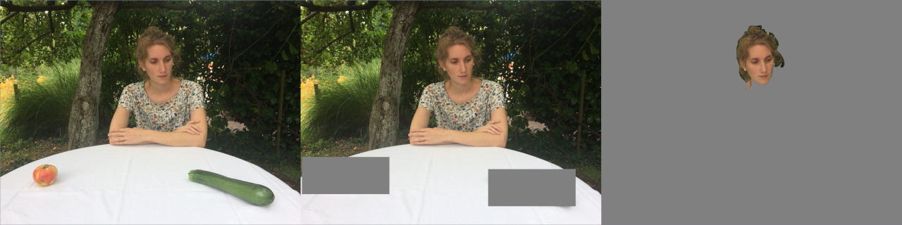

#   Gaze cueing with and without context

This repository contains Python code to run a modified Posner task in the 
laboratory at the [University of Würzburg](http://www.i1.psychologie.uni-wuerzburg.de/en/ekp/home).

## Prerequisits

### Installation by hand:

Installation of Python 2.7
+   only tested on Python 2.7, but should also run on Python 3
  
```$ (sudo) pip install psychopy``` 

+   A detailed List of dependencies can be found 
[here](http://psychopy.org/installation.html#manual-install).

### Installation with PsychoPy (Standalone):

Download and install [Psychopy (Standalone)](http://psychopy.org/installation.html).

## Stimuli

### Example


+   original image
+   image with context and placeholders for targets (to cover objects)
+   image with out context

### Original

I have no permission to publish the original stimuli used in this experiment.
Please [contact me](mailto:jonas.grossekathoefer@uni-wuerzburg.de) for further details.
